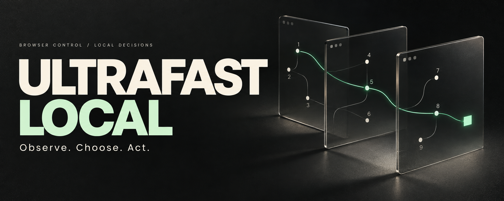
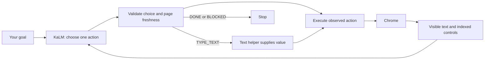

# Ultrafast Local

**Give Chrome a goal. Inspect every decision. Run the decision model yourself.**

A browser agent built around a small loop: observe the page, choose a supported action, execute it. [KaLM-Jev Nano](https://github.com/KaLM-Embedding/KaLM-Jev) ranks actions grounded in the live page. A separate text model supplies field values only when typing is needed.

[Get started](docs/setup.md) · [Results](docs/validation.md) · [KaLM vs. Laya](docs/backends.md) · [Contribute](CONTRIBUTING.md)


## The loop, opened up

The inspector exposes what the model saw and what the browser did. **Choose next** pauses at a prediction. **Run automatically** continues the loop. Each action stays traceable to an element in the observation.



- **One decision request per cycle.** KaLM chooses a complete operation and target pair from a finite set. The hosted TypeSafe option retains the upstream operation and target heads.
- **Targets come from Chrome.** The model chooses observed IDs. It cannot supply selectors or executable code.
- **Control state changes the choice.** Checkbox and dropdown candidates describe the local values that the action would produce. Visible context helps distinguish nearby links.
- **The browser checks again before acting.** Freshness, target identity and click occlusion checks reject stale or obstructed actions. Browser mutations are never automatically retried.
- **Screenshots are for inspection.** Decisions use structured page observations. The browser client has no PyTorch dependency, and inference can live on another machine behind SSH.

`DONE` is a model decision. The example checks separately inspect the resulting page; a confident answer alone never counts as a passed task.

## Run it

You need Python 3.12+, [uv](https://docs.astral.sh/uv/), Chrome and a running KaLM service. **Start with the [setup guide](docs/setup.md)** for the model download, Windows or Linux commands, and an optional desktop SSH connection.

With the decision service running, the Windows inspector starts with:

```powershell
git clone https://github.com/rcrandon/jev-ultrafast.git jev-browserUse
cd jev-browserUse
uv sync --locked
# Fresh checkout only; preserve an existing .env.
Copy-Item .env.example .env
powershell -NoProfile -ExecutionPolicy Bypass -File scripts/start-browser.ps1
uv run --env-file .env jev-doctor
uv run --env-file .env jev
```

Open **[localhost:8766](http://127.0.0.1:8766)**. The Reading room fixture is a useful first task: it needs no accounts or text helper. Configure an OpenAI-compatible text model before trying tasks that type into fields.

## Why KaLM?

KaLM fits this experiment because its reranker exposes a finite-choice HTTP interface and configurable input limits. The adapter gives it the natural-language goal as a query and grounded browser actions as candidate documents. Reusing Jev's request structure alone was insufficient; action descriptions, nearby content and observed form state mattered in live tests.

| Backend | Role here | Practical boundary |
| --- | --- | --- |
| **KaLM-Jev Nano** | Default local decision service | Works on tested simple tasks; completion and recovery still fail in other cases |
| **Laya / Laya-MLX** | Evaluated alternative | Tested browser requests were truncated; a runtime port would not resolve that input-budget issue |
| **TypeSafe Jev** | Explicit hosted option | Requires its own key; uses the upstream decision format |

The available evidence favors continuing with KaLM, not declaring a benchmark winner. Linux MLX support exists, but the tested GTX 1080 is below its CUDA requirement. Laya's original PyTorch implementation was evaluated on CPU. Read the [comparison, licensing distinctions and pinned sources](docs/backends.md).

There is **no automatic fallback to a paid service**. The configured decision provider handles the request or the run stops with an error.

## Use it in Python

```python
from jev_ultrafast import Agent

with Agent(
    "https://en.wikipedia.org/wiki/Main_Page",
    "Open the article about Ada Lovelace.",
) as agent:
    for state in agent.run():
        print(state["elapsed_ms"], state["status"])
```

Run your script with `uv run --env-file .env python your_script.py`. This shows the library interface; it is not an accuracy claim for Wikipedia. Keep a separate outcome check for tasks you evaluate.

## Read the code

| File | Responsibility |
| --- | --- |
| [agent.py](jev_ultrafast/agent.py) | Observe, decide, execute, repeat |
| [snapshot.js](jev_ultrafast/snapshot.js) | Visible content, indexed controls and freshness guards |
| [kalm_policy.py](jev_ultrafast/kalm_policy.py) | Grounded action descriptions for the local reranker |
| [model.py](jev_ultrafast/model.py) | Provider routing, response validation and the text helper |
| [kalm_backend.py](jev_ultrafast/kalm_backend.py) | Reduced vocabulary projection and upstream score checks |
| [demo.py](jev_ultrafast/demo.py) | The local inspector |

Offline checks:

```text
uv run ruff check .
uv run pytest
node --check jev_ultrafast/static/app.js
node --check jev_ultrafast/snapshot.js
uv build
```

[Contributing](CONTRIBUTING.md) covers real-browser checks, reproducing model failures and the CI workflow. [Current validation](docs/validation.md) records the measured results; [earlier experiments](docs/experiments.md) preserve the attempts that led here.

## Scope and credits

This is an independent fork of [browser-use/jev-ultrafast](https://github.com/browser-use/jev-ultrafast), based on revision `1231850`. Browser Use's compact loop, Browser Harness integration and guarded execution are the foundation. Hosted Jev footage and measurements remain in the [archived upstream README](docs/upstream-readme.md), clearly separate from local results.

The inherited MVP does not cover shadow roots, frames, canvas, file uploads, popup tabs, nested scrolling or arbitrary keyboard widgets. Live text generation has not yet passed validation in the tested local setup. KaLM's choice probabilities are uncalibrated and do not measure task success.

Project code retains the upstream [MIT license](LICENSE). Model weights and optional runtimes carry separate terms. In particular, KaLM-Jev has no explicit code license at the inspected revision; its checkpoint card and Gemma base-model terms must be considered separately. See the [dependency license notes](docs/backends.md#licenses-and-reproducibility).

[Browser Use](https://github.com/browser-use/browser-use) · [Browser Harness](https://github.com/browser-use/browser-harness) · [KaLM-Jev](https://github.com/KaLM-Embedding/KaLM-Jev) · [Laya-MLX](https://github.com/mizorewww/laya-mlx) · [TypeSafe](https://docs.typesafe.ai/introduction)
